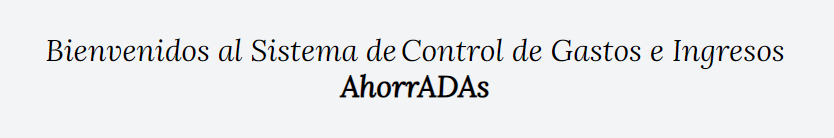

<!-- ===========================================================
                            PRESENTACIÓN 
     =========================================================== -->

   

***

   

***

 ## Tabla de Contenidos:
 
- [AhorrADAs](#ahorradas)
- [Tecnologías](#tecnologías)
- [Construcción](#construcción)
- [Menús](#menus)
- [Mobile](#mobile)
- [Contáctanos](#contáctanos)

---
 

<!-- ==================================================
                         CONTENIDO 
     ================================================== -->

## *AhorrADAs*

[:top:](#tabla-de-contenidos)  

Las aplicaciones web, comúnmente conocidas como apps, se han convertido en una parte esencial de nuestra vida cotidiana. Desde simplificar tareas diarias hasta ofrecer entretenimiento.  
La app `AhorrADAs` es una app web, que permite que cualquier usuario pueda realizar registro de operaciones personales o de una PYME, y de esta manera pasar de un proceso manual a uno digital, lo que conlleva un gran ahorro de tiempo. Además, esto simplifica el trabajo y genera una reducción en el costo de las rendiciones de gastos. 
Por medio de la app `AhorrADAs` el usuario acceder de forma sencilla a reportes e información de gastos, ganancias y sus balances.
Por su sencillez, `AhorrADAs` es una gran herramienta que ayuda a simplificar el control de las rendiciones, a llevar un exhaustivo control gastos y ganancias, y así evitar realizar operaciones innecesarias, que llevarían a un déficit personal o empresarial. 

La app `AhorrADAs`, fue diseñada de tal manera que puede ser utilizada en diferentes dispositivos, lo que implica un correcto diseño responsive. 

( FALTA imagen )

   

 

Fue desarrollado como Trabajo Final del "Módulo 3 - JavaScript", de la capacitación de `"Desarrollo Frontend"` dictado por [ADA ITW](https://www.linkedin.com/school/ada-itw/), y se encuentra incluido en nuestros `Portfolios`, de tal manera de reflejar el grado de avance, apropiación y uso de los conocimiento adquiridos y asimilados durante la capacitación.

> [!NOTE]
> Visite nuestros portafolios: [PORTFOLIO MAGUI](https://maguibrollo.github.io/ADA_Portafolio_mod01_tf/)  -  [PORTFOLIO LUCÍA]().

 

## *Tecnologías*
[:top:](#tabla-de-contenidos)  
La app AhorrADAs fue desarrollada utilizando las siguientes tecnologías:  

|   |   |  |
| :---: | :---: | :---: |
|Lenguaje de marcado de hipertexto. Consiste en marcas basado en etiquetas que otorgan la estructura básica de la app.| Tailwind es un framework de CSS que tiene Utility Classes, que son clases específicas para estilo. | Lenguaje de programación. Otorga interactividad a las distintas secciones que conforman la app.|

 

## *Construcción*
[:top:](#tabla-de-contenidos)  
AhorrADAs, presenta una pantalla principal de bienvenida. Permite navegar por los diferentes menús utilizando teclado, mouse o táctil, en el caso de dispositivos móviles. Los menús disponibles son: [Inicio](#inicio), [Balance](#balance), [Categorías](#categorías), [Reportes](#reportes).  
Además, dispone del botón `Modo claro` / `Modo Oscuro` que permite intercambiar entre los dos modos de visualización. La visualización se realiza por defecto en el Modo que se tenga seleccionado como tema en el sistema operativo, pero puede cambiar entre `Modo Claro` y `Modo Oscuro` y este cambio permanecerá.

 

|MODO CLARO| MODO OSCURO |
|    :---:  |   :---:  |
|| |

---

## *Menús*
[:top:](#tabla-de-contenidos)  

- [Inicio](#inicio)
- [Balance](#balance)
- [Categorías](#categorías)
- [Reportes](#reportes)

---

#### Inicio
[:top:](#menús)  
Da la bienvenida a la aplicación.  

   

---

#### Balance
[:top:](#menús)
El menú `Balance`, presenta tres secciones: Balance, Filtros y Operaciones.

(.....  imagen ..........)

   

Secciones:
- **Balance**: Permite conocer el total de Ganancias, el total de Gastos y el Total del balance, positivo o negativo, de las operaciones visibles, que dependen de lo que se ha seleccionado en la sección "Filtros". 

- **Filtros**: Puede seleccionar entre las siguientes opciones: 
 Mostrar/Ocultar Flitros: muestra u oculta los filtros, para mayor disponibilidad de espacio, en especial en móviles.  
TIPO: seleccionar el tipo de operación "Gastos" o "Ganancias". 
CATEGORÍAS: seleccionar una categoría en especial, o seleccionar todas las categorías. 
FECHA DESDE: seleccionar a partir de qué fecha se desea visualizar las operaciones. 
FECHA HASTA: seleccionar hasta qué fecha se desea visualizar las operaciones. 
ORDENAR POR: seleccionar el orden de visualización, por fecha, por monto o por descripción. 

 
- Operaciones:......

 

> [!NOTE]
> Si se minimiza el tamaño de la ventana, horizontalmente, la sección `Operaciones` se visualizará en la parte inferior (ver [Mobile](#mobile)).

---

#### Categorías
[:top:](#menús)

 

---

#### Reportes
[:top:](#menús)

   

El menú reportes organiza los datos de las operaciones, para mostrar toda la información relevante en forma resumida. Las secciones son `Resumen`, `Total por Categorías` y `Total por Mes`. La organización y detalle de este reporte permite conocer los gastos, ganancias y balances por tipo de operación, por categoría o por mes. Cada sección presenta la información justa y resumida, que le permitirá a todo usuario conocer sus movimientos y de esta manera tomar decisiones sobre como continuar con sus operaciones. 

   

   

   

---

## *Mobile:*
[:top:](#tabla-de-contenidos)  
Todas los menús explicados anteriormente, se encuentran disponibles para dispositivos móviles:

|Modo Oscuro| Modo Claro|
|:---:|:---:|
|||

 

|Menú | Menú |
|:---:|:---:|
|||

 

|Pantalla Horizontal| 
|:---:|
||

| Edición Horizontal|
|:---:|
||

 

---

## *Contáctanos:*
[:top:](#tabla-de-contenidos)  

(Falta Lucía)
--- 